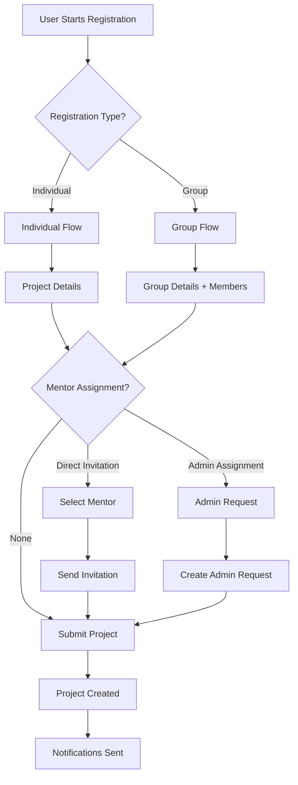

# Complete Project Registration System Guide

## Table of Contents
1. [System Overview](#system-overview)
2. [User Roles & Permissions](#user-roles--permissions)
3. [Project Registration Flow](#project-registration-flow)
4. [Individual Registration](#individual-registration)
5. [Group Registration](#group-registration)
6. [Mentor Assignment](#mentor-assignment)
7. [Admin Assignment](#admin-assignment)
8. [Data Flow & Storage](#data-flow--storage)
9. [User Views & Interfaces](#user-views--interfaces)
10. [API Endpoints](#api-endpoints)

---

## System Overview

The Project Registration System allows users to register projects either as individuals or as groups, with optional mentor assignment through direct invitation or admin assignment.

### Key Features:
- **Individual & Group Registration**: Users can register projects individually or as part of a group
- **Mentor Assignment**: Direct invitation to specific mentor or admin assignment
- **File Upload**: Support for proposal files and project images
- **Role-based Access**: Different views and permissions for students, mentors, and admins
- **Real-time Updates**: Activity tracking and status management

---

## User Roles & Permissions

### Student
**Capabilities:**
- ✅ Register new projects (individual or group)
- ✅ Upload proposal files and images
- ✅ Invite specific mentors to projects
- ✅ Request admin assignment for mentors
- ✅ View own project status and mentor responses
- ✅ Manage group member invitations

**Limitations:**
- ❌ Cannot assign mentors to other students
- ❌ Cannot access admin assignment panel
- ❌ Cannot view other students' projects

### Mentor
**Capabilities:**
- ✅ View and respond to student invitations
- ✅ Accept/reject project mentorship requests
- ✅ Manage assigned students and groups
- ✅ View project details and proposal files
- ✅ Remove students/groups from mentorship
- ✅ Access mentor dashboard with assignments

**Limitations:**
- ❌ Cannot assign mentors to projects
- ❌ Cannot access admin functions
- ❌ Cannot view unassigned projects

### Super Admin
**Capabilities:**
- ✅ All mentor capabilities
- ✅ Assign mentors to students and groups
- ✅ View all projects and assignments
- ✅ Manage user accounts and roles
- ✅ Access admin dashboard and analytics
- ✅ Override assignment decisions

---

## Project Registration Flow



---

## Individual Registration

### Student View

#### Step 1: Project Details
```
┌─────────────────────────────────────┐
│ Project Registration Modal          │
├─────────────────────────────────────┤
│ Title: [Project Title]           │
│ Description: [Project Description] │
│ GitHub URL: [Optional]          │
│ Live URL: [Optional]             │
│ Tags: [Tag1, Tag2, Tag3]     │
│ Proposal File: [Upload Button]     │
└─────────────────────────────────────┘
```

#### Step 2: Mentor Assignment
```
┌─────────────────────────────────────┐
│ Mentor Assignment Method           │
├─────────────────────────────────────┤
│ ○ No Mentor Assignment          │
│ ○ Invite Specific Mentor        │
│ ○ Admin Assignment Request     │
└─────────────────────────────────────┘
```

**If "Invite Specific Mentor":**
- Mentor selection dropdown appears
- Optional message to mentor
- Invitation sent to selected mentor

**If "Admin Assignment Request":**
- Request sent to super admin
- Admin reviews and assigns appropriate mentor

#### Step 3: Submission
- Project created with `registrationType: 'individual'`
- Mentor invitation created if applicable
- Notifications sent to relevant parties

---

## Group Registration

### Student View

#### Step 1: Group Setup
```
┌─────────────────────────────────────┐
│ Group Registration               │
├─────────────────────────────────────┤
│ Group Name: [Group Name]        │
│ Group Lead: [Current User]       │
│ Partners:                       │
│ ┌─────────────────────────────┐   │
│ │ Partner 1 Email: [____] │   │
│ │ Partner 2 Email: [____] │   │
│ │ + Add Partner              │   │
│ └─────────────────────────────┘   │
└─────────────────────────────────────┘
```

#### Step 2: Project Details
Same as individual registration + group information

#### Step 3: Group Creation Process
```
1. User enters group details and partner emails
2. System validates partner emails (must be registered users)
3. Group created in database with:
   - name: Group Name
   - description: "GroupName - Group project"
   - studentIds: [Array of User IDs from partner emails]
4. Project linked to created group
5. Group lead set as current user
```

---

## Mentor Assignment

### Direct Invitation Flow

#### Student Side
1. **Select Mentor**: Browse and select specific mentor
2. **Add Message**: Optional personal message to mentor
3. **Send Invitation**: System creates mentor invitation
4. **Track Status**: View invitation status (pending/accepted/rejected)

#### Mentor Side
1. **Receive Notification**: New invitation in mentor profile
2. **View Details**: See project and student information
3. **Make Decision**: Accept or reject invitation
4. **Respond**: Add response message (optional)

#### Mentor Invitation View
```
┌─────────────────────────────────────┐
│ Mentor Invitations               │
├─────────────────────────────────────┤
│ ┌─────────────────────────────┐   │
│ │ Student: John Doe         │   │
│ │ Email: john@university.edu │   │
│ │                         │   │
│ │ Project: AI Research      │   │
│ │ Description: Research on...  │   │
│ │                         │   │
│ │ Proposal: [View Button]   │   │
│ │ Message: "Please mentor..." │   │
│ │                         │   │
│ │ [Accept] [Reject]        │   │
│ └─────────────────────────────┘   │
│                                 │
│ Status: ⏳ Pending           │
└─────────────────────────────────────┘
```

### Group Project Invitations
For group projects, mentors see additional group information:

```
┌─────────────────────────────────────┐
│ Group Project Invitation          │
├─────────────────────────────────────┤
│ Student: Group Lead Name        │
│ Email: lead@university.edu     │
│                                 │
│ Project: AI Research            │
│                                 │
│ ┌─ Group Details ─────────┐      │
│ │ Group Name: "Team Alpha" │      │
│ │ Members (4):              │      │
│ │ • John Doe                │      │
│ │ • Jane Smith               │      │
│ │ • Bob Johnson              │      │
│ │ • +1 more                │      │
│ └───────────────────────────┘      │
│                                 │
│ [Accept] [Reject]              │
└─────────────────────────────────────┘
```

---

## Admin Assignment

### Student Request Flow

#### Step 1: Request Submission
```
┌─────────────────────────────────────┐
│ Admin Assignment Request          │
├─────────────────────────────────────┤
│ Requesting mentor for:          │
│ - Project: "AI Research"       │
│ - Type: Group Project          │
│ - Group: "Team Alpha"         │
│                                 │
│ Request sent to Super Admin     │
│ Status: ⏳ Under Review        │
└─────────────────────────────────────┘
```

#### Step 2: Admin Review
1. **Receive Request**: Admin gets notification of new assignment request
2. **Review Details**: Examine project, group, and requirements
3. **Select Mentor**: Choose appropriate mentor based on:
   - Expertise match
   - Current workload
   - Mentor availability
4. **Create Assignment**: Assign mentor to student/group
5. **Notify Parties**: Inform both student and mentor

#### Admin Assignment View
```
┌─────────────────────────────────────┐
│ Admin Assignment Dashboard         │
├─────────────────────────────────────┤
│ Pending Requests: 5            │
│                                 │
│ ┌─ Request #1 ──────────────┐   │
│ │ Project: "AI Research"      │   │
│ │ Type: Group Project         │   │
│ │ Group: "Team Alpha"         │   │
│ │ Requested by: John Doe     │   │
│ │                         │   │
│ │ [Assign Mentor] [View Details] │   │
│ └─────────────────────────────────┘   │
│                                 │
│ [View All Requests]             │
└─────────────────────────────────────┘
```

---

## Data Flow & Storage

### Project Data Structure
```javascript
{
  title: "Project Title",
  description: "Project Description",
  githubUrl: "https://github.com/user/repo",
  liveUrl: "https://project-demo.com",
  tags: ["AI", "Machine Learning", "Web"],
  images: ["/uploads/project1.jpg", "/uploads/project2.jpg"],
  proposalFile: "/uploads/proposal.pdf",
  
  // Registration Type
  registrationType: "individual" | "group",
  
  // Individual Project
  authorId: "user_id",
  author: {
    id: "user_id",
    name: "Student Name",
    email: "student@university.edu"
  },
  
  // Group Project
  groupId: "group_id",
  groupLead: {
    id: "lead_user_id",
    name: "Lead Name",
    email: "lead@university.edu"
  },
  members: ["student1@email.com", "student2@email.com"],
  
  // Mentor Assignment
  mentorStatus: "not_assigned" | "pending" | "assigned",
  mentorInvitation: {
    mentorName: "Selected Mentor",
    status: "pending",
    timestamp: "2024-01-22T10:00:00Z"
  },
  
  // Metadata
  createdAt: "2024-01-22T10:00:00Z",
  isDeleted: false
}
```

### Group Data Structure
```javascript
{
  name: "Team Alpha",
  description: "Team Alpha - Group project",
  mentorId: "mentor_id", // Assigned mentor
  studentIds: ["user1_id", "user2_id", "user3_id"],
  isActive: true,
  createdAt: "2024-01-22T10:00:00Z"
}
```

### Mentor Invitation Data Structure
```javascript
{
  mentorId: "mentor_id",
  studentId: "student_id",
  groupId: "group_id", // For group projects
  projectId: "project_id",
  projectTitle: "Project Title",
  projectDescription: "Project Description",
  proposalFile: "/uploads/proposal.pdf",
  message: "Please mentor my project...",
  status: "pending" | "accepted" | "rejected",
  sentAt: "2024-01-22T10:00:00Z",
  respondedAt: "2024-01-22T15:30:00Z",
  responseMessage: "I'd be happy to mentor this project"
}
```

---

## User Views & Interfaces

### Student Dashboard
```
┌─────────────────────────────────────┐
│ Student Dashboard                │
├─────────────────────────────────────┤
│ My Projects                    │
│ ┌─ Project 1 ──────────────┐   │
│ │ AI Research                │   │
│ │ Status: Mentor Assigned     │   │
│ │ Mentor: Dr. Smith          │   │
│ │ [View] [Edit] [Delete]    │   │
│ └─────────────────────────────┘   │
│                                 │
│ ┌─ Project 2 ──────────────┐   │
│ │ Web Application           │   │
│ │ Status: Pending Assignment  │   │
│ │ [View] [Edit] [Delete]    │   │
│ └─────────────────────────────┘   │
│                                 │
│ [Register New Project]           │
└─────────────────────────────────────┘
```

### Mentor Profile
```
┌─────────────────────────────────────┐
│ Mentor Profile                  │
├─────────────────────────────────────┤
│ Profile Information              │
│ Name: Dr. John Smith          │
│ Email: smith@university.edu   │
│ Department: Computer Science    │
│ Expertise: AI, ML, Web Dev   │
│                                 │
│ ┌─ Mentor Dashboard ──────────┐   │
│ │ Assigned Students: 15        │   │
│ │ Assigned Groups: 3           │   │
│ │ Total Assignments: 18        │   │
│ └─────────────────────────────┘   │
│                                 │
│ ┌─ Recent Invitations ─────────┐   │
│ │ Student: John Doe           │   │
│ │ Project: AI Research        │   │
│ │ Status: ⏳ Pending        │   │
│ │ [Accept] [Reject]         │   │
│ └─────────────────────────────┘   │
│                                 │
│ [View All Assignments]         │
└─────────────────────────────────────┘
```

### Super Admin Dashboard
```
┌─────────────────────────────────────┐
│ Admin Dashboard                 │
├─────────────────────────────────────┤
│ System Overview                │
│ Total Projects: 1,247         │
│ Total Users: 892               │
│ Pending Assignments: 23         │
│                                 │
│ ┌─ Assignment Management ───────┐   │
│ │ Pending Requests: 23         │   │
│ │ ┌─ Request #1 ────────────┐ │ │
│ │ │ Project: AI Research      │ │ │
│ │ │ Requested by: John Doe │ │ │
│ │ │ Type: Group Project     │ │ │
│ │ │ [Assign Mentor]         │ │ │
│ │ └─────────────────────────┘ │ │
│ │                             │ │
│ │ [View All Requests]        │ │
│ └─────────────────────────────┘ │
│                                 │
│ ┌─ User Management ─────────────┐   │
│ │ Total Students: 756          │   │
│ │ Total Mentors: 89           │   │
│ │ Total Admins: 47             │   │
│ │ [Manage Users]              │   │
│ └─────────────────────────────┘   │
│                                 │
│ [System Settings]              │
└─────────────────────────────────────┘
```

---

## API Endpoints

### Project Registration
#### POST /api/projects
**Purpose**: Create new project (individual or group)

**Request Body**:
```javascript
// FormData for file upload
const formData = new FormData();
formData.append('title', projectTitle);
formData.append('description', projectDescription);
formData.append('type', 'individual' | 'group');
formData.append('proposalFile', file);

// Group specific
formData.append('groupName', groupName);
formData.append('groupLeadId', user.id);
formData.append('partners[0]', partner1@email.com);
formData.append('partners[1]', partner2@email.com);

// Mentor assignment
formData.append('mentorId', mentorId);
formData.append('assignmentMethod', 'invitation' | 'admin');
formData.append('message', optionalMessage);
```

**Response**:
```javascript
{
  success: true,
  project: { /* Project data */ },
  adminRequestCreated: true,
  adminRequestMessage: "Your admin assignment request has been created..."
}
```

### Mentor Invitations
#### GET /api/mentor/invitations
**Purpose**: Get mentor's pending and responded invitations

**Response**:
```javascript
{
  invitations: [
    {
      _id: "invitation_id",
      mentorId: "mentor_id",
      studentId: {
        _id: "student_id",
        fullName: "Student Name",
        email: "student@university.edu",
        photo: "/uploads/avatar.jpg"
      },
      groupId: {
        _id: "group_id",
        name: "Team Alpha",
        description: "Team Alpha - Group project",
        studentIds: [
          { name: "Member 1", email: "member1@university.edu" },
          { name: "Member 2", email: "member2@university.edu" }
        ]
      },
      projectId: {
        _id: "project_id",
        title: "Project Title",
        createdAt: "2024-01-22"
      },
      projectTitle: "Project Title",
      projectDescription: "Project Description",
      proposalFile: "/uploads/proposal.pdf",
      message: "Please mentor my project...",
      status: "pending" | "accepted" | "rejected",
      sentAt: "2024-01-22T10:00:00Z",
      respondedAt: "2024-01-22T15:30:00Z"
    }
  ],
  stats: {
    total: 25,
    pending: 5,
    accepted: 18,
    rejected: 2
  }
}
```

#### POST /api/mentor/invitations
**Purpose**: Respond to mentor invitation (accept/reject)

**Request Body**:
```javascript
{
  invitationId: "invitation_id",
  decision: "accept" | "reject",
  responseMessage: "Optional response message"
}
```

### Admin Assignment
#### GET /api/admin/assignment-data
**Purpose**: Get data for admin assignment panel

**Response**:
```javascript
{
  success: true,
  data: {
    mentors: [
      {
        id: "mentor_id",
        name: "Dr. John Smith",
        email: "smith@university.edu",
        photo: "/uploads/mentor.jpg"
      }
    ],
    students: [
      {
        id: "student_id",
        name: "Student Name",
        email: "student@university.edu",
        photo: "/uploads/student.jpg"
      }
    ],
    groups: [
      {
        id: "group_id",
        name: "Team Alpha",
        description: "Team Alpha - Group project"
      }
    ]
  }
}
```

#### POST /api/admin/assignments
**Purpose**: Create admin assignment request

**Request Body**:
```javascript
{
  projectId: "project_id",
  projectTitle: "Project Title",
  projectDescription: "Project Description",
  proposalFile: "/uploads/proposal.pdf",
  requestedBy: "student_id",
  requestedToType: "student" | "group",
  studentId: "student_id", // for individual projects
  groupId: "group_id" // for group projects
}
```

---

## File Storage & Uploads

### Upload Directory Structure
```
public/
├── uploads/
    ├── proposals/
    │   ├── project1_proposal.pdf
    │   └── project2_proposal.pdf
    ├── images/
    │   ├── project1_image1.jpg
    │   ├── project1_image2.png
    │   └── project2_image1.jpg
    └── avatars/
        ├── student1_avatar.jpg
        ├── mentor1_avatar.png
        └── admin1_avatar.jpg
```

### File Upload Process
1. **Client Side**: FormData with file objects
2. **Server Side**: 
   - Validate file types and sizes
   - Generate unique filename with UUID
   - Store in appropriate directory
   - Return file path for database storage
3. **Database**: Store file paths, not file content
4. **Access**: Serve files via public URLs

---

## Error Handling & Validation

### Common Error Scenarios
1. **Invalid Partner Emails**: Partner emails must match registered users
2. **Duplicate Group Names**: Group names must be unique
3. **Mentor Unavailable**: Selected mentor may have reached capacity
4. **File Upload Limits**: Proposal files have size restrictions
5. **Permission Denied**: Users can only access their own data

### Validation Rules
- Project title: Required, max 200 characters
- Description: Required, max 2000 characters  
- Partner emails: Must be valid registered users
- Group name: Required, unique, max 100 characters
- Proposal files: PDF, max 10MB
- Images: JPG/PNG, max 5MB each

---

## Security & Permissions

### Access Control Matrix
| Action | Student | Mentor | Admin |
|---------|----------|---------|---------|
| Register Project | ✅ | ❌ | ✅ |
| View Own Projects | ✅ | ❌ | ✅ |
| Invite Mentors | ✅ | ❌ | ✅ |
| Respond to Invitations | ❌ | ✅ | ✅ |
| Assign Mentors | ❌ | ❌ | ✅ |
| View All Projects | ❌ | ❌ | ✅ |
| Manage Users | ❌ | ❌ | ✅ |

### Data Privacy
- Students can only see their own projects and invitations
- Mentors can only see invitations sent to them
- Admins have system-wide access for management purposes
- All file uploads are validated and scanned

---

## Best Practices & Guidelines

### For Students
1. **Provide Clear Project Descriptions**: Help mentors understand your project
2. **Choose Relevant Mentors**: Select mentors whose expertise matches your project
3. **Complete Group Information**: Ensure all group members are registered users
4. **Upload Quality Proposals**: Well-structured proposals increase acceptance chances

### For Mentors
1. **Respond Promptly**: Students await your decisions
2. **Provide Constructive Feedback**: Help students improve their projects
3. **Manage Workload**: Accept projects you can properly mentor
4. **Update Status**: Keep assignment information current

### For Admins
1. **Fair Assignment**: Consider expertise, workload, and compatibility
2. **Clear Communication**: Inform all parties of assignment decisions
3. **Regular Reviews**: Periodically review assignment effectiveness
4. **System Maintenance**: Monitor and optimize system performance

---

## Troubleshooting

### Common Issues & Solutions

**Issue**: Group registration not working
**Solution**: 
- Verify partner emails match registered users
- Check group name uniqueness
- Ensure all required fields are completed

**Issue**: Mentor invitation not received
**Solution**:
- Check mentor email accuracy
- Verify mentor account is active
- Check spam folders

**Issue**: Admin assignment request stuck
**Solution**:
- Contact admin directly
- Verify project details are complete
- Check system status

**Issue**: File upload failing
**Solution**:
- Check file size limits
- Verify file format (PDF for proposals)
- Check internet connection

---

## System Status & Monitoring

### Key Metrics to Track
- Project registration success rate
- Mentor response time
- Assignment completion rate
- User satisfaction scores
- System performance metrics

### Regular Maintenance Tasks
- Database cleanup of old inactive projects
- File storage optimization
- User account verification
- System backup procedures

---

*This guide covers the complete project registration system from all user perspectives. For specific technical implementation details, refer to the API documentation and source code.*
